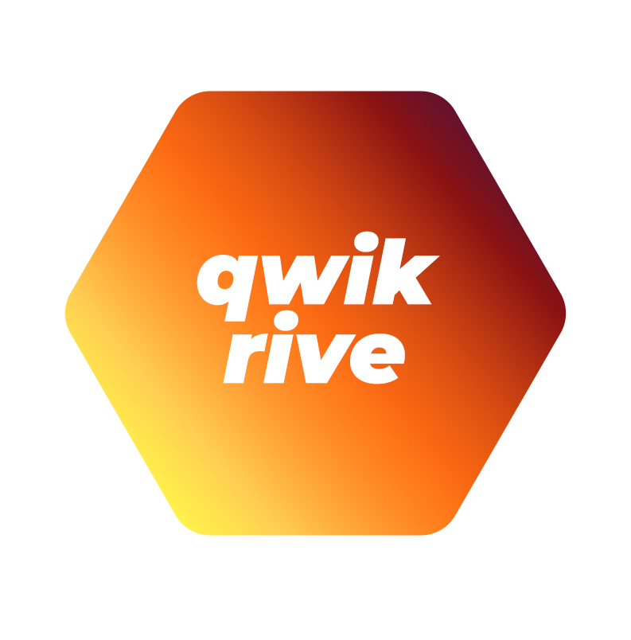

<p align="center">
  <br>
  
  <br>
</p>

<h1 align='center'>Qwik Rive</h1>

<div align='center'>
Rive Component for <a href='https://github.com/BuilderIO/qwik'>Qwik</a>.
<br><br>
<a href='http://badge.fury.io/js/qwik-rive'>

</a>
</div>

<details>
<summary>Table of Contents</summary>

- :star: [Rive Overview](#rive-overview)
- 🚀 [Getting Started & API docs](#getting-started)
- :mag: [Supported Versions](#supported-versions)
- :books: [Examples](#examples)
- :runner: [Migration Guides](#migration-guides)
- 👨‍💻 [Contributing](#contributing)
- :question: [Issues](#issues)

</details>

<br>

A React runtime library for [Rive](https://rive.app).

This library is a wrapper around the [JS/Wasm runtime](https://github.com/rive-app/rive-wasm), giving full control over the js runtime while providing components and hooks for React applications.

## Installation

Install through npm:

```
npm install --save qwik-rive
```

## Usage

```js
import { component$, useStore } from '@builder.io/qwik';
import { QwikRive, Options } from 'qwik-rive';

export default component$(() => {
  const store = useStore<Options>({
      src: 'https://cdn.rive.app/animations/vehicles.riv',
  });
  return (
    <>
      <div>
        <QwikRive options={store}></QwikRive>
      </div>
    </>
  );
});

```

## Rive Overview

[Rive](https://rive.app) is a real-time interactive design and animation tool that helps teams create and run interactive animations anywhere. Designers and developers use our collaborative editor to create motion graphics that respond to different states and user inputs. Our lightweight open-source runtime libraries allow them to load their animations into apps, games, and websites.

:house_with_garden: [Homepage](https://rive.app/)

:blue_book: [General help docs](https://help.rive.app/)

🛠 [Resources for building in Rive](https://rive.app/resources/)

## Getting Started

Follow along with the link below for a quick start in getting Rive React integrated into your React apps.

[Getting Started with Rive in React](https://help.rive.app/runtimes/overview/web-js)

[API documentation](https://help.rive.app/runtimes/overview/web-js/parameters-and-return-values)

## Supported Versions

This library supports React versions `^0.11.0`.

## Examples

Check out our Storybook instance that shows how to use the library in small examples, along with code snippets! This includes examples using the basic component, as well as the convenient hooks exported to take advantage of state machines.

- [Example page](https://rive-app.github.io/rive-react)
- [Login screen w/ input tracking](https://rive-app.github.io/rive-use-cases/?path=/story/example-loginformcomponent--primary)
- [Mouse tracking](https://codesandbox.io/s/rive-mouse-track-test-t0y965?file=/src/App.js)
- [Accessibility concerns](https://blog.rive.app/accessible-web-animations-aria-live-regions/)

## Migration Guides

Using an older version of the runtime and need to learn how to upgrade to the latest version? Check out the migration guides below in our help center that help guide you through version bumps; breaking changes and all!

[Migration guides](https://help.rive.app/runtimes/overview/web-js/migrating-from-rive-js)

## Contributing

We love contributions! Check out our [contributing docs](./CONTRIBUTING.md) to get more details into how to run this project, the examples, and more all locally.

## Issues

Have an issue with using the runtime, or want to suggest a feature/API to help make your development life better? Log an issue in our [issues](https://github.com/rive-app/rive-react/issues) tab! You can also browse older issues and discussion threads there to see solutions that may have worked for common problems.